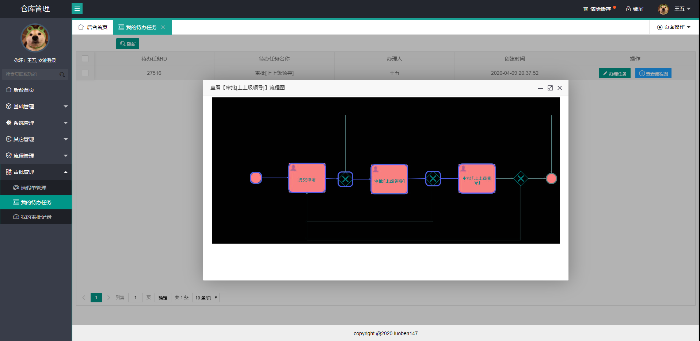

# warehouse
springboot+shiro+layui+activiti 仓库管理系统

##项目介绍
- 项目前端基于layuicms2.0模板
- RBAC权限控制
- shiro认证授权
- activiti5.22 流程控制
- 集成web设计器

## 截图展示
    
   
   
   
   
   
   
   
   
   
   
   
   
   
   
   
   
   